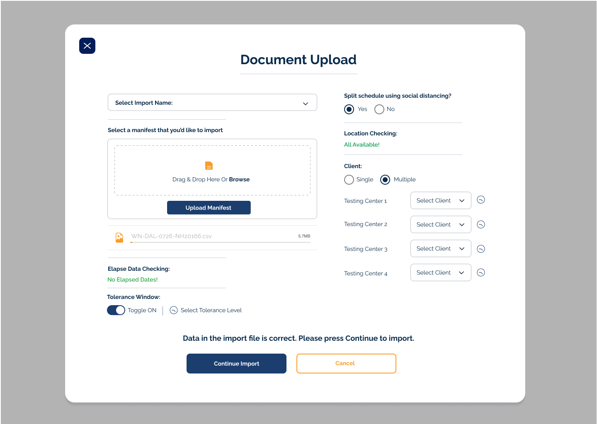

# File Upload Modal(Assessment)

Tech Stacks: React, Vite, Material UI
Node Version: > 18(Required)

## Available Scripts

In the project directory, you can run:

### `npm run dev`

Runs the app in the development mode.\
Open [http://localhost:5173](http://localhost:5173) to view it in your browser.

Click this link [https://file-upload-modal.web.app/](https://file-upload-modal.web.app/) to preview it in your browser.

## Requirements

